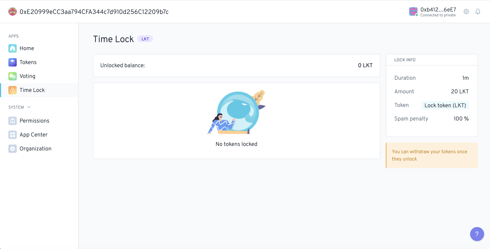

# Time Lock 

[](https://circleci.com/gh/1Hive/time-lock-app)
[](https://coveralls.io/github/1Hive/lock-app?branch=master&service=github)
[](https://crytic.io/1Hive/lock-app)

1Hive's Time Lock app allows an Aragon organization to require users to lock tokens by sending them to the Time Lock app for a configurable period of time in order to forward an intent. For example the organization may require users to lock 100 tokens for 1 month before creating a new vote. The user would be able to come back in a month and claim their locked tokens.

#### 🐲 Project stage: Mainnet

#### 🚨 Security review status: [Contracts audited](https://diligence.consensys.net/audits/2019/12/dandelion-organizations/)

## How does it work?

The Time Lock app is a [forwarder](https://hack.aragon.org/docs/forwarding-intro). By granting the Time Lock app a permission like `Create Votes` the user will be prompted and required to lock tokens before the user's intent can be forwarded.

We keep track of when locks are made and by whom so that users are only able to re-claim locks that they have made after the duration has elapsed.

We recommend (but do not require) that the lock function is used with the [Token Balance Oracle](https://github.com/1Hive/token-oracle) to restrict use of the application to members of the organization. This is how permissions are set up in our [demo template](https://github.com/1Hive/time-lock-app/blob/master/contracts/examples/Template.sol#L122). This allows the Oracle to check if the `msg.sender` of a proposal has tokens (and thus is a member of the DAO who's qualified to create proposals) before granting the `canForward()` functionality. This means that in order to submit a proposal one must lock tokens, and in order to lock tokens one must be a member of the DAO.

### Initialization

The Time Lock app is initialized with a `_token`, `_lockDuration`, `_lockAmount` and `_spamPenaltyFactor` parameters which determines the token to be locked, how long tokens are locked, the amount of tokens to lock and a penalty percentage for spamming proposals.
At initialization the `_token` parameter can be set to an ERC20 token. It cannot be changed. If a change is necessary the user can install a new instance and change permissions in the organization to reflect the change.

### Roles

The Time Lock app implements the following roles:

- **Change Duration**: This allows for changing the configured duration.
- **Change Lock Amount**: This allows for changing the amount of tokens required to lock.
- **Change Spam Penalty**: This allows for changing the spam penalty factor for subsequent locks.
- **Lock Tokens**: This should be granted to `Any Entity` and paramaterized using the [ACL Token Oracle](https://github.com/1Hive/token-oracle) or similar contract.

### Interface

The Time Lock app provides an interface for a user to see any locks they have made, and how much time until they can re-claim the lock. It also shows the total unlocked balance they currently have for re-claim.

The Time Lock app does not provide an interface for changing the duration or lock amount. This can be done via the aragonCLI or directly interacting with the contract.

## How to run Time Lock app locally

First make sure that you have node, npm, and the aragonCLI installed and working. Instructions on how to set that up can be found [here](https://hack.aragon.org/docs/cli-intro.html). You'll also need to have [Metamask](https://metamask.io) or some kind of web wallet enabled to sign transactions in the browser.

Git clone this repo.

```sh
git clone https://github.com/1Hive/time-lock-app.git
```

Navigate into the `time-lock-app` directory.

```sh
cd time-lock-app
```

Install npm dependencies.

```sh
npm i
```

Deploy a dao with Time Lock app installed on your local environment.

```sh
npm run start:template
```

If everything is working correctly, your new DAO will be deployed and your browser will open http://localhost:3000/#/YOUR-DAO-ADDRESS. It should look something like this:



You will also see the configuration for your local deployment in the terminal. It should look something like this:

```sh
    Ethereum Node: ws://localhost:8545
    ENS registry: 0x5f6f7e8cc7346a11ca2def8f827b7a0b612c56a1
    APM registry: aragonpm.eth
    DAO address: YOUR-DAO-ADDRESS
```

### Template

The Time Lock app is initialized with a `_lockDuration` of 1:30 minutes, a `_lockAmount` of 20 LKT tokens and a `_spamPenaltyFactor` of 100%.
The app has the permission to create votes, so if you try to mint yourself some tokens from the `tokens` app it will first prompt you to approve the Time Lock app to transfer 20 LKT tokens to the contract on your behalf.
Once the forwarding is performed you should be able to see the current lock and a timer indicating how much time until you can re-claim your 20 LKT tokens.

### Re-claiming your tokens

Once your balance is unlocked you will be able to re-claim your tokens via the withdraw button.
You will have to input how many locks you'll re-claim and they'll be withdrawn on a FIFO basis (first in first out)

## Aragon DAO Installation

The Time Lock app has been published to APM on Mainnet and Rinkeby at `time-lock.aragonpm.eth`

To deploy to an organization you can use the [aragonCLI](https://hack.aragon.org/docs/cli-intro.html).

```sh
aragon dao install <dao-address> time-lock.aragonpm.eth --app-init-args <token-address> <lock-duration> <lock-amount>
```

You have to set up permissions depending on your requirements for users to lock tokens before forwarding an intent. So for example if you want to require users to lock tokens before creating votes you should grant the Time Lock app the role to create votes on the Voting app.

:warning: <span style="color:#f3d539">Currently the Time Lock app has to be the first forwarder in the transaction pathing in order to properly prompt you to perform an approve for the required amount of tokens</span>

## Contributing

We welcome community contributions!

Please check out our [open Issues](https://github.com/1Hive/time-lock-app/issues) to get started.

If you discover something that could potentially impact security, please notify us immediately. The quickest way to reach us is via the #dev channel in our [team Keybase chat](https://keybase.io/team/1hive). Just say hi and that you discovered a potential security vulnerability and we'll DM you to discuss details.
