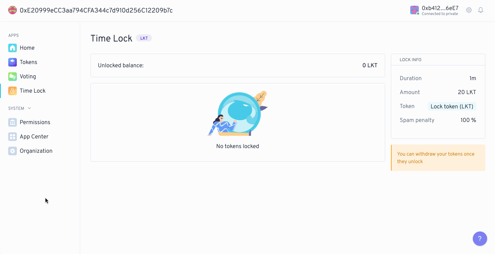
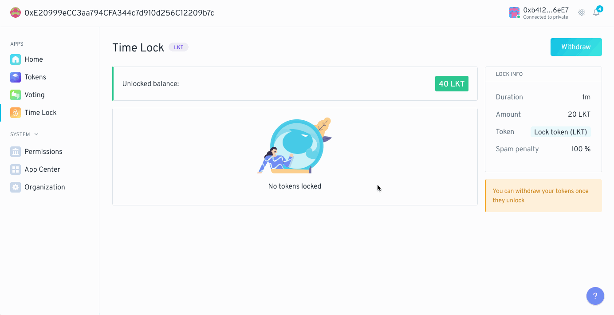

 

## What is the Lock app?

The app allows users to lock tokens before forwarding an "intent." Here intent refers to a transaction to do something. Often this will be to create votes in the DAO, but really it can be for anything. You can set permissions on the Lock app such that a user must lock tokens before taking any action of your choosing.

 

## Using the Lock app

The lock app has 2 main features: locking tokens and withdrawing locked tokens. As a forwarder, the lock app is engaged whenever a user tries to take the action that the lock app has permissions on. This prompts the user to first lock tokens, then it forwards their intent to take an action. The app itself also has a UI that shows users their current locks and allows them to withdraw.

### Creating a lock

Locks are created whenever the user signals an intent to take an action that the lock app has permissions over. We say "signal" and "intent" because ultimately the user might not be able to take that action. Creating a transaction signals that the user _wants_ to do something, but they are only allowed to do that thing if they have permission to do so. Setting the lock app to the permissions of an action (say to create a vote) creates a requirement that the user locks tokens before creating a vote. This will require two transactions, one to approve the lock app to transfer the required amount of tokens on the user's behalf and another to lock the tokens and forward the desired action. If the locking of tokens fails or is aborted, the user will not be able to take that action because the lock app will not forward their intent.

The lock app will only ask users to create locks when they signal intent to take actions that lock app controls. This happens outside of the UI of the lock app itself and is injected into the transaction signing flow. There is no way to arbitrarily lock tokens for no reason at all.

  

### Withdrawing a lock

Unlike creating locks, which happens within the flow of taking an action, withdrawing locks happens within the UI of the lock app. Users can open the app anytime to see locks that are currently active. When a lock has expired and is ready to be withdrawn it will show up in the Unlocked Balance section at the top of the app window. Users can then click the Withdraw button to retrieve locked tokens.

Withdrawing tokens happens on a lock by lock basis. Users can select the amount of locks they want to withdraw, but they do not select the token amount directly. This is because the lock app is only aware of locks, their amounts, and their duration. Users are telling the lock app to delete their old lock and send back those locked tokens. The lock is what's being sent back, and the tokens are a byproduct of that transaction.

  

 
