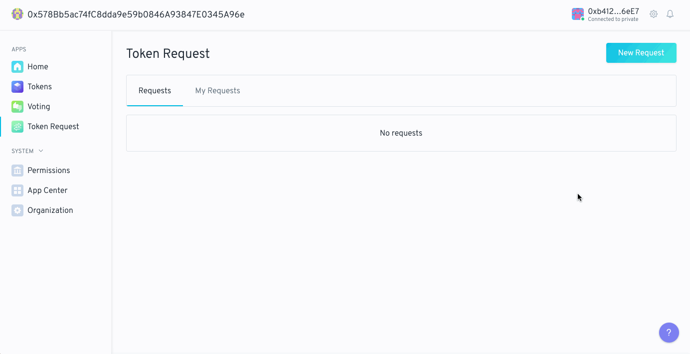
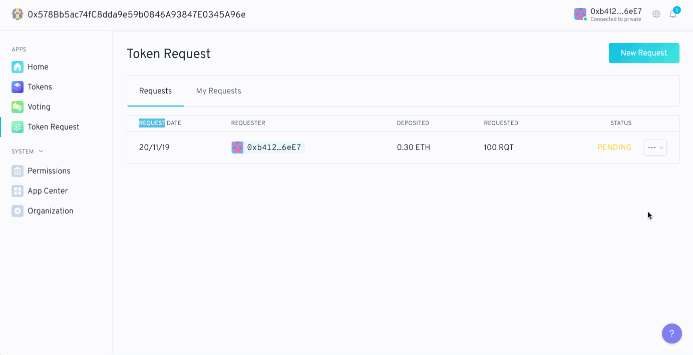
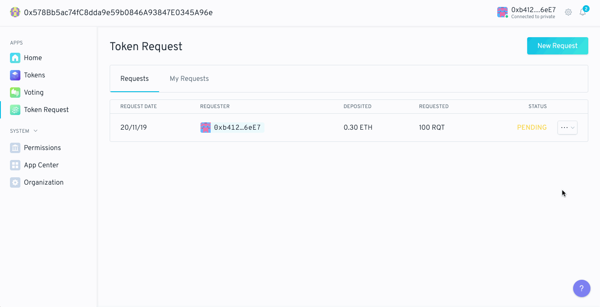

 

## What is the Token Request app?

1Hive's Token Request app allows users to create requests for Organization's tokens in exchange for payment. For example a user may request minting 100 organization tokens in exchange for 100 DAI. The request would require a vote to approve, if the vote is rejected, the user would receive their payment back and if it is approved the payment would be deposited in the organization's vault.

 

## Using the Token Request app

From a user's perspective there are three actions to take:

- create a token request
- submit a token request
- withdraw a token request

### Creating a Token Request

Creating a token request is the first action for a user to take. This allows someone outside of the DAO to offer a deposit to receive some of the DAO's native tokens. Click on the blue "New Request" button in the top right of the app window. The "Requested Amount" section is the amount of the DAO's tokens that you want. The "Offered Amount" is the amount of tokens that you want to offer in exchange. If the DAO supports multiple tokens, you will be able to offer any of the available tokens. If you've configured the parameters correctly the "Create request" button should light up and be blue. Clicking on it will allow you to create a transaction for a new Token Request.

    

### Submitting a Token Request

Once your Token Request is created you will see it in the main window of the app. The status should say `PENDING`. If you click on the "Actions" button you'll be able to "Submit" or "Withdraw" the Token Request. Your Token Request is not completed until you submit it. To submit your Token Request click "Submit" and then click the "Create transaction" button that appears in the signing side panel. This will create a transaction to submit the Token Request for the DAO's members to vote on. If the vote passes and is enacted, the requested amount of tokens will be minted to the requester's address and the offered amount will be transfered to the vault.

    

### Withdrawing a Token Request

You can withdraw a Token Request at any time. This is done by clicking on the "Actions" button in the main window, then selecting "Withdraw." You can do this for any Token Requests that you have created whether they were just created, submitted, and/or rejected. Once you click "Withdraw" you will be prompted to create a transaction. This will withdraw the Token Request and refund your deposit. Once a token is withdrawn the app's main window will show `WITHDRAWN` as the status of the Token Request.

    

